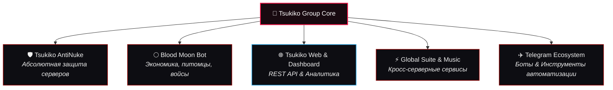

<div align="center">

  <!-- HERO BANNER -->
  <a href="https://discord.gg/bmoon">
    
  </a>

  <br/><br/>

  <!-- MAIN TITLE -->
  <h1>
    
    <span style="color: #FF1A4D; font-weight: 900; letter-spacing: 1px;">TSUKIKO GROUP</span>
    <span style="color: #FFFFFF; font-weight: 300;">(月子)</span>
    
  </h1>

  <p align="center">
    <b>Экосистема разработки Discord/Telegram-ботов нового поколения, кибербезопасности и веб-сервисов</b><br>
    <i>«Сила короля обречает на одиночество. Но строка за строкой мы меняем этот цифровой мир.»</i>
  </p>

  <!-- QUICK BADGES -->
  <p align="center">
    <a href="https://discord.gg/bmoon">
      
    </a>
    <a href="https://t.me/Lisovskypredbot">
      
    </a>
    <a href="https://github.com/L1sovskyy">
      
    </a>
    
    
  </p>

  <!-- GLOWING CUSTOM DIVIDER -->
  

</div>

<br/>

## 🏮 О нашей организации • About Tsukiko Group

<table>
  <tr>
    <td width="34%" align="center" valign="middle">
      
      <br/>
      <sub><b>✦ Маскот экосистемы — Tsukiko (月子) ✦</b><br/><i>The Blood Moon Guardian</i></sub>
    </td>
    <td width="66%" valign="top">
      <h3>🌙 Цифровая империя под знаком Кровавой Луны</h3>
      <p>
        <b>Tsukiko Group</b> — независимая студия разработки и инженерное сообщество под руководством <b>Егора (L1sovskyy)</b>. Мы создаем высокопроизводительные Discord и Telegram боты, комплексные системы противодействия крашам (AntiNuke), модули виртуальной экономики и современные веб-порталы.
      </p>
      <p>
        Наш визуальный код вдохновлен эстетикой <b>Blood Moon</b>, красной паучьей лилии (<i>Higanbana</i>) и неонового киберпанка. Мы объединяем бескомпромиссную скорость бэкенда, криптографическую защиту и премиальный дизайн.
      </p>
      <ul>
        <li>🛡️ <b>Безопасность первого класса:</b> Мгновенная нейтрализация рейдов и атак на инфраструктуру.</li>
        <li>⚡ <b>Экстремальная скорость:</b> Микросервисная архитектура и оптимизированные асинхронные пайплайны.</li>
        <li>🎨 <b>Авторский арт и дизайн:</b> Уникальный визуальный почерк во всех интерфейсах и сервисах.</li>
      </ul>
    </td>
  </tr>
</table>

<br/>

<div align="center">
  
</div>

<br/>

## ⚔️ Ключевые проекты экосистемы • Ecosystem Core

<div align="center">



</div>

<br/>

### 🌌 Каталог флагманских разработок

<table>
  <thead>
    <tr>
      <th width="30%">Проект / Репозиторий</th>
      <th width="45%">Описание и функционал</th>
      <th width="25%">Стек & Статус</th>
    </tr>
  </thead>
  <tbody>
    <tr>
      <td>
        <b>🛡️ Tsukiko AntiNuke</b><br/>
        <sub><i>Абсолютный щит серверов</i></sub>
      </td>
      <td>
        Интеллектуальная система защиты Discord-сообществ. Мгновенная реакция (<10мс) на удаление каналов, массовые баны, несанкционированные изменения ролей. Автоматические шифрованные бэкапы каждые 6 часов и режим изоляции рейдов.
      </td>
      <td>
        <code>Python</code> <code>Asyncio</code><br/>
        <code>Discord.py</code> <code>Redis</code><br/>
        
      </td>
    </tr>
    <tr>
      <td>
        <b>🌕 Blood Moon Bot</b><br/>
        <sub><i>Многофункциональный бот</i></sub>
      </td>
      <td>
        Флагманский бот для комьюнити: кастомные графические Canvas-профили (Love, Classic, Blood), система питомцев (<i>Crimson Fox, Eclipse Dragon, Shadow Cat, Vampire Bat</i>), приватные авто-комнаты и экономика.
      </td>
      <td>
        <code>Node.js</code> <code>Discord.js</code><br/>
        <code>Canvas</code> <code>SQLite/PG</code><br/>
        
      </td>
    </tr>
    <tr>
      <td>
        <b>🌐 Tsukiko Web & Dashboard</b><br/>
        <sub><i>Веб-портал & Управление</i></sub>
      </td>
      <td>
        Центральный веб-сервис с живым мониторингом состояния ботов, REST API шлюзом, GCM-шифрованием конфигураций и защищенной панелью управления серверами.
      </td>
      <td>
        <code>Node.js</code> <code>Express</code><br/>
        <code>Cloudflare</code> <code>Vanilla CSS</code><br/>
        
      </td>
    </tr>
    <tr>
      <td>
        <b>⚡ Tsukiko Global & Moderation</b><br/>
        <sub><i>Кросс-серверный комплекс</i></sub>
      </td>
      <td>
        Глобальная синхронизация модерации, система верификации, тикеты, управление персоналом и музыкальный движок высокой четкости.
      </td>
      <td>
        <code>Python</code> <code>Lavalink</code><br/>
        <code>WebSockets</code><br/>
        
      </td>
    </tr>
  </tbody>
</table>

<br/>

<div align="center">
  
</div>

<br/>

## 🎨 Дизайн-система «Blood Moon Design»

> [!IMPORTANT]
> Каждый элемент экосистемы оформлен в едином авторском стиле — от оверлеев Discord до веб-панелей и терминальных интерфейсов.

<div align="center">
  <table>
    <tr>
      <td align="center"><b>🎭 События & Ивенты</b></td>
      <td align="center"><b>📜 Правила & Гайды</b></td>
    </tr>
    <tr>
      <td></td>
      <td></td>
    </tr>
    <tr>
      <td align="center"><b>🔊 Приватные комнаты</b></td>
      <td align="center"><b>⚔️ Модерация & Щит</b></td>
    </tr>
    <tr>
      <td></td>
      <td></td>
    </tr>
  </table>
</div>

<br/>

### 🩸 Палитра брендовых оттенков:

| Токен | Цвет | HEX | Применение |
| :--- | :---: | :--- | :--- |
| **Blood Crimson** |  | `#FF1A4D` | Главный акцент, кнопки, свечение, алерты |
| **Deep Scarlet** |  | `#E60039` | Градиенты, активные плашки, рамки |
| **Obsidian Dark** |  | `#0A0A0C` | Основной фон, контрастные карточки |
| **Abyssal Void** |  | `#121218` | Вторичный фон, панели и оверлеи |
| **Spider Lily White**|  | `#F4F4F8` | Читабельный высококонтрастный текст |

<br/>

<div align="center">
  
</div>

<br/>

## 🛠️ Стек технологий & Инструментарий

<div align="center">

  <h3>Языки и Среда выполнения</h3>
  
  
  <br/><br/>
  
  <h3>Фреймворки, Базы данных & DevOps</h3>
  

</div>

<br/>

```python
class TsukikoEcosystem:
    def __init__(self):
        self.organization = "Tsukiko Group (月子)"
        self.founder = "Egor (L1sovskyy)"
        self.mascot = "Tsukiko (Blood Moon Girl)"
        self.domain = "Cybersecurity, Discord Bots, Web Applications"
        self.active_shields = ["AntiNuke Engine v2", "Auto-Backup Vault", "Raid Lockdown"]
        
    def mission_statement(self) -> str:
        return "Создание непоколебимой защиты и эстетически совершенного софта."

tsukiko = TsukikoEcosystem()
print(tsukiko.mission_statement())
```

<br/>

<div align="center">
  
</div>

<br/>

## 📊 Мониторинг и Живая Статистика

<div align="center">

  <table width="100%">
    <tr>
      <td width="33%" align="center">
        <h3>🛡️ AntiNuke Shield</h3>
        <p><b>Реакция:</b> <code>&lt; 10ms</code><br/><b>Аптайм:</b> <code>99.98%</code><br/><b>Бэкапы:</b> <code>Каждые 6ч</code></p>
      </td>
      <td width="33%" align="center">
        <h3>⚡ Gateway Latency</h3>
        <p><b>Discord Ping:</b> <code>~4ms</code><br/><b>REST API:</b> <code>~12ms</code><br/><b>WebSocket:</b> <code>Active</code></p>
      </td>
      <td width="33%" align="center">
        <h3>🌌 Сообщество</h3>
        <p><b>Серверов под защитой:</b> <code>10+</code><br/><b>Пользователей:</b> <code>8,000+</code><br/><b>Сервер:</b> <code>Blood Moon</code></p>
      </td>
    </tr>
  </table>

  <br/>

  <!-- GITHUB METRICS -->
  
  &nbsp;
  

  <br/><br/>
  
  

</div>

<br/>

<div align="center">
  
</div>

<br/>

## 💬 Присоединяйтесь к Сообществу • Contacts & Links

<div align="center">
  <p>Мы открыты к новым проектам, коллаборациям и защите ваших серверов!</p>

  <a href="https://discord.gg/bmoon">
    
  </a>
  &nbsp;
  <a href="https://t.me/Lisovskypredbot">
    
  </a>
  &nbsp;
  <a href="https://github.com/L1sovskyy">
    
  </a>
  &nbsp;
  <a href="https://github.com/L1sovskyy/Aibotself">
    
  </a>

  <br/><br/>

  <p>
    <sub>© 2026 <b>Tsukiko Group (月子)</b> • Создано с душой и любовью к коду от <b>Егора Lisovsky</b>.<br/>
    All rights reserved. Designed under the Blood Moon.</sub>
  </p>

  

</div>
